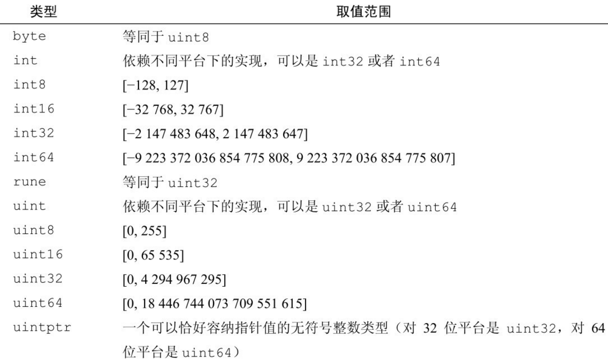

> “In Go, the code does exactly what it says on the page.” – Andrew Gerrand

# Go 变量标识符

给一个 go 变量命名(标识符)的时候，通常使用大骆驼(BigCamel)和小骆驼(smallCamel)命名法，只要保证不和内置的25个关键词冲突就行。
当然 go 也内置了一些自己的标识符，见下图，我建议你最好不要使用这些同名的预定义标识符来命名变量。
只要是非空的字母或者数字（第一个必须是字母），并且不和关键词冲突就是合法的标识符。注意标识符区分大小写，并且在 go
里边只有大写开头的才能导出被其他包使用（后文我们再讨论）。


# 静态/动态类型，弱类型/强类型

静态，动态类型指的是类型是在编译期还是运行期间确定，而弱类型和强类型指的是有没有隐式类型转换。
比如 Python 就是动态强类型语言(很多人误以为弱类型)，而 php/js 是动态弱类型语言。
go 是静态强类型语言，我们在编写代码的时候需要先声明变量的类型（或者编译器推导），
在不同类型之间转换的时候需要我们强制使用类型转换符。

# go 如何声明一个变量

go 中声明一个变量很简单，使用 var 关键字就可以了，声明之后默认使用其类型的零值初始化。
比如int 类型默认是0，字符串就是空串。

当然为了简化 go 还提供了一种使用 `:=` 直接声明并且初始化的方式。请编写如下代码观察输出(我建议你纯手敲练练手速，不要直接复制)：

```go
package main

import "fmt"

func main() {
	var i int64             // 声明一个 int64 变量。注意类型放在后边，习惯就好了
	var b string            // 声明一个字符串
	fmt.Println("i is ", i) // 0
	fmt.Println("b is ", b) // ""

	// 同时声明并且赋值
	var floatNum float64 = 1.0
	var price1, price2 float64 = 8.8, 9.6
	fmt.Println(floatNum, price1, price2)

	// 还有一种简化方式，声明并且赋值，编译器负责推断类型
	ii := 1
	s := "Hello Go!"
	fmt.Println("ii is ", ii) // 1
	fmt.Println("s is ", s)   // Hello Go!"
}
```

# Go 的基础类型

无论是学习过程式、面向对象还是并发编程，我们都需要首先学习一门语言的基础类型，对于大部分业务常用编程语言来说就是数值类型和字符串类型。

## bool 类型

bool 就是真或者假，一些编程语言使用 0 和非 0 表示。但是 go 里比如 if 语句后边只能是 bool 值或者返回 bool
值的表达式，而不像 c 一样可以使用 int 值。


```go
// 让我们编写一些小的 demo 代码来测试一下
func boolDemo() {
	var b1 bool
	b2 := false
	b3 := true
	if b1 {
		fmt.Println("b1 is true")
	}
	if b2 {
		fmt.Println("b2 is true")
	}
	if b3 {
		fmt.Println("b3 is true")
	}
}
```

## 数值类型(整型和浮点类型)

### 整数类型

整数类型可以说是我们最常用的一种类型，如果你用 python 的话非常省心(Python3 int 就是大数类，内存够用无需担心溢出)，但是 go 里边却有非常多的 int 类型。
对于一门追求性能的语言来说，有些地方可以省内存就省一点。这里需要注意的就是每种类型取值范围，确保不要超范围了。业务中经常使用也就是
int64/int32 了。



当然作为整数，一般常用的那就是加减乘除之类的数学运算了：


```go
// 同样我们编写简单的测试代码来熟悉它们，确保你不要直接复制粘贴。整本电子书和代码都是笔者一个字一个字敲出来的
func intDemo() {
	var i64 int64
	i64 = 10
	fmt.Println(i64 + 10)

	i32 := int32(42)
	fmt.Println(i32 + 10)

	fmt.Println(
		math.MaxInt64, // 需要导入 math 包，见本章示例代码
	)

	a, b := 10, 0
	fmt.Println(a / b) // Boom! 会发生什么。错误处理我们后文介绍
}

func main() {
	intDemo() // 虽然还没讲到 函数，不过相信你也知道如何调用了
}
```

### 浮点数类型

接下来是浮点数，很多场景我们计算的时候都需要有小数点，go 里有两种类型的浮点数。


math 包里很多函数以 float64 作为参数，你可以提前看一下 go 文档看看提供了哪些函数。
浮点数同样也是常见的加减乘除，这里请大家自己编写一些代码来练习，笔者不再赘述。

### 数值转换小提示

- 注意不同数值类型之间转换(大转小)可能有截断，比如一个 int64 转成 int32 类型的数字
- 可以使用 int(float) 转换一个 浮点数到整数，小数部分会丢弃。但是如果浮点数的值超过了整数类型范围，结果是不可预期的
- 注意计算机使用二进制不能精确表示 float 数字，当比较两个浮点数时你要格外小心不能用等号直接比较。(通常作差绝对值小于一个很小的阈值)
- 业务中经常使用 float64，因为 math 函数很多接受 float64 作为参数
- 你可以通过 math.MaxInt32 类似的定义查看一个类型的最大值

### 复数类型

复数在常见业务代码中使用比较少，这里就略过了。你可以使用 complex() 来创建复数。

## 延伸(大整数运算)

某些场景下， 如果64位依然满足不了你，你可以使用大整数 big.Int 和 有理数 big.Rat 类型。


## 字符串

业务中另一个最常用的就是字符串(string)了，web 开发几乎天天就是和字符串打交道。Go的字符串是使用 UTF-8
编码的字符序列，这意味着你可以使用任意国家的语言。
Go 中我们可以使用双引号(")和反引号(\`)来创建字符串，区别反引号会忽略转义符，并且可以创建多行字符串。

```go
func stringDemo() {
	// 如果字符串本身也有双引号，就需要把里边的双引号使用 \ 转义
	s1 := "\"Hello Go\""
	// 使用反斜线就可以直接包含双引号了
	s2 := `"Hello Go"`
	fmt.Println(s1) // 打印出 "Hello Go"
	fmt.Println(s2) // 打印出 "Hello Go"

	s3 := `
你好
`
	s4 := "Golang !"
	fmt.Println(s3 + s4)
}
```

字符串支持如下操作：


### 字符串和数值类型的转换

在 Python 里进行这种转换是一件很容易的事情，但是 go 里边可不方便。我列出来以下代码你就知道啦：
注意这里的 Atoi 是 Ascii  to Integer 的缩写，视频里有个口误。

```go
func testConvert() { // 测试 int 和 string(decimal) 互相转换的函数
	// https://yourbasic.org/golang/convert-int-to-string/
	// int -> string
	sint := strconv.Itoa(97)
	fmt.Println(sint, sint == "97")

	// byte -> string
	bytea := byte(1)
	bint := strconv.Itoa(int(bytea))
	fmt.Println(bint)

	// int64 -> string
	sint64 := strconv.FormatInt(int64(97), 10)
	fmt.Println(sint64, sint64 == "97")

	// int64 -> string (hex) ，十六进制
	sint64hex := strconv.FormatInt(int64(97), 16)
	fmt.Println(sint64hex, sint64hex == "61")

	// string -> int
	_int, _ := strconv.Atoi("97")
	fmt.Println(_int, _int == int(97))

	// string -> int64
	_int64, _ := strconv.ParseInt("97", 10, 64)
	fmt.Println(_int64, _int64 == int64(97))

	// https://stackoverflow.com/questions/30299649/parse-string-to-specific-type-of-int-int8-int16-int32-int64
	// string -> int32，注意 parseInt 始终返回的是 int64，所以还是需要 int32(n) 强转一下
	_int32, _ := strconv.ParseInt("97", 10, 32)
	fmt.Println(_int32, int32(_int32) == int32(97))

	// int32 -> string, https://stackoverflow.com/questions/39442167/convert-int32-to-string-in-golang
	i := 42
	strconv.FormatInt(int64(i), 10) // fast
	strconv.Itoa(int(i))            // fast
	fmt.Sprint(i)                   // slow

	// int -> int64 ，不会丢失精度
	var n int = 97
	fmt.Println(int64(n) == int64(97))

	// string -> float32/float64  https://yourbasic.org/golang/convert-string-to-float/
	f := "3.14159265"
	if s, err := strconv.ParseFloat(f, 32); err == nil {
		fmt.Println(s) // 3.1415927410125732
	}
	if s, err := strconv.ParseFloat(f, 64); err == nil {
		fmt.Println(s) // 3.14159265
	}
}
```

## 常量和变量

常量顾名思义你没法改变它，在一些全局变量中使用 const 会更加安全。常量表达式是在编译期计算。
对于一些被整个模块或者其他模块使用的变量来说，最好定义成 const 防止被意外修改。
比如我们会经常在一些文件开头看到类似 const 定义：

```go
const (
	Sunday    = 0
	Monday    = 1
	Tuesday   = 2
	Wednesday = 3
	Thursday  = 4
	Friday    = 5
	Saturday  = 6
)
```

## 枚举

对于上述这种递增场景，go 还提供了一种更加简洁的方式来定义，使用 iota
表达式，它可以帮助我们完成自增操作(只有这种常见才推荐去使用 iota)

```go
const (
	Sunday = iota
	Monday
	Tuesday
	Wednesday
	Thursday
	Friday
	Saturday
)
```
你可以编写代码打印一下看看剩下的值是多少？

# 小问题：

- 为什么有 int 还需要 int32 和 int64，业务代码里如何选择呢？
- 请你尝试打印每种 int 类型的数值范围？

# 参考：

- 部分图片来自《Go 语言程序设计》
- [Ultimate Visual Guide to Go Enums and iota](https://blog.learngoprogramming.com/golang-const-type-enums-iota-bc4befd096d3)
